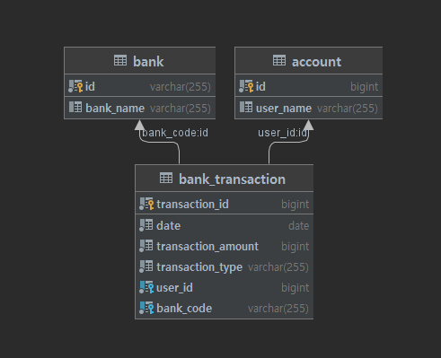

# 소개 문서

### API 명세

| Method     | URI | Parameters |Description|
| ----------- | ----------- | ----------- | -----------|
| POST      | http://localhost:8080/bt/upload  | { file: input.csv }</br>content-type:multipart/form-data   | CSV 업로드 endpoint|
| GET   | http://localhost:8080/bt/{userId}/transactions  | { userId: 유저명,</br> date: 날짜 </br> type: 거래타입 }   | 유저별 트랜잭션 조회 endpoint|
| GET | http://localhost:8080/bt | { bank: 은행,</br> date: 날짜 </br> type: 거래타입 | 은행별 트랜잭션 조회 endpoint|

호출 예시
```
http://localhost:8080/bt/1/transactions?date=2022-02-02&type=WITHDRAW
http://localhost:8080/bt?bank=004&date=2022-02-02&type=WITHDRAW
```

```
TIP: 정상구동되지 않는다면 아래 api server(8081, 8082, 8083)로 직접 호출 부탁드립니다. 
```

### 구동방법

구동 순서는 나열된 것과 같으며, Eureka가 동적 바인딩을 하기에 순서를 준수하지 않아도 되지만 가급적 아래 순서로 부탁드립니다.</br>
`Docker image로 제공할 예정이었으나 시간적 여유가 부족했던 점 양해 바랍니다.`

#### 필요 Port number

8080 - Loadbalancer</br>
8070 - EurekaServer</br>
8081, 8082, 8083 - API server</br>
3306 - Mysql Server

#### Mysql

`/docker` 디렉토리에서 아래 명령어를 실행합니다.
```
docker-compose -f mysql.yaml up -d
```


#### Eureka Server

새로운 Command Prompt를 열고 `/eureka` 디렉토리에서 아래 명령어를 실행합니다.
```
./mvnw package -DskipTests
cd target
java -jar ./eureka-0.0.1-SNAPSHOT.jar -DskipTests
```

#### API Server

새로운 Command Prompt를 열고 `/bank-transaction` 디렉토리에서 아래 명령어를 실행합니다.
```
./mvnw package -DskipTests
cd target
// 아래 명령어를 개별 프롬프트에서 실행하시면 보다 모니터링하기 쉽습니다.
java -jar ./bank-transaction-0.0.1-SNAPSHOT.jar --server.port=8081
java -jar ./bank-transaction-0.0.1-SNAPSHOT.jar --server.port=8082
java -jar ./bank-transaction-0.0.1-SNAPSHOT.jar --server.port=8083
```

#### Loadbalancer Server
새로운 Command Prompt를 열고 `hystrix-loadbalancer` 디렉토리에서 아래 명령어를 실행합니다.
```
./mvnw package -DskipTests
cd target
// 아래 명령어를 개별 프롬프트에서 실행하시면 보다 모니터링하기 쉽습니다.
java -jar .\hystrix-loadbalancer-0.0.1-SNAPSHOT.jar -DskipTests

```

### ERD 캡처 화면



