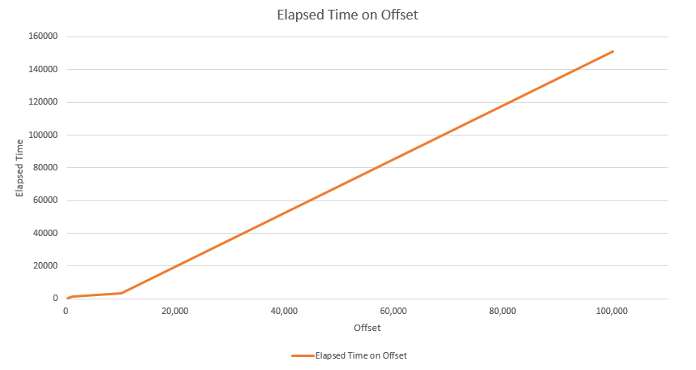

# 테스트 내역

---

#### Load Data vs Bulk Insert


Load Data는 통상 Insert 대비 20배의 성능을 낼 수 있다. 



#### Bulk Insert OOM 해결
모니터링 Setup
```
docker run -p 9090:9090 -v /path/to/prometheus.yml:/etc/prometheus/prometheus.yml prom/prometheus
```
